<h1 align="center">
  
</h1>

<h3 align="center">DevOps Engineer | Azure | Terraform | Ansible | Cloud Automation</h3>

  

  

<h3 align="center"><code>ashish@github ~ $ ./contributions.sh</code></h3>

  

  

  
  

---

## 🛠️ Tech Stack & Tools

### Cloud & Infrastructure

### CI/CD & Version Control

### Databases

### Agentic Dev & Scripting

### ✍️ Random Dev Quote

<!-- Proudly created with GPRM ( https://gprm.itsvg.in ) -->

## Contact

- **Email**: [ashish200221@gmail.com](mailto:ashish200221@gmail.com)
- **LinkedIn**: [Ashish Pal](https://www.linkedin.com/in/ashish-pal-b959b1254/)
- **Portfolio**: [Ashish Pal](https://ash-21.netlify.app/)
